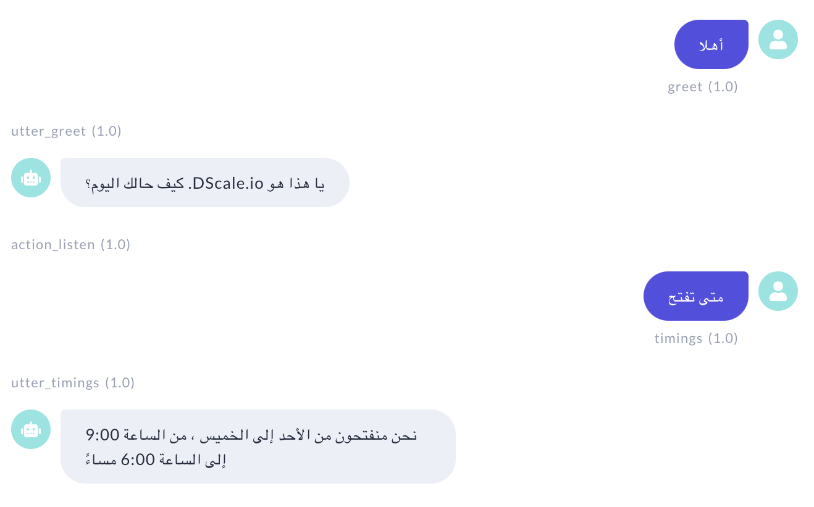

# rasa-arabic-tutorial

Medium Draft

Build your chatbot in Arabic with Rasa: A Complete Guide

1. **Short intro about chatbots and need for multilingual agents**

Chatbots are computer programs build to simulate conversations with human users. This can be achived through NLP, a branch of Artificial Intellegence that helps computers understand human language. As chatbots gain popularity globally, there is increasing need to build multilingual agents that can cater to regions with linguistic diversity. This is likely to have a huge impact on customer engagement and satisfaction, and can prove to be a great asset for any organization. This article talks about building a chatbot in the Arabic Language using [rasa](https://rasa.com/). 


2. **Set up**

Suggest/Include resource for creating a python virtual env

To get started, you can [install rasa](https://rasa.com/docs/rasa/installation/) using python (above 3.6)
```
pip3 install rasa==2.7.1
```
Create a project using the following command:
```
rasa init
```
Once your project has been initiated, use the below command so that you are able to use [stanza](https://stanfordnlp.github.io/stanza/) in your rasa nlu pipeline. Stanza is a Python NLP Package that supports many languages including Arabic.
```
pip install "rasa_nlu_examples[stanza] @ git+https://github.com/RasaHQ/rasa-nlu-examples.git"
```
Within your current project directory, create a new python file named download_stanza.py and paste the below code.

```python
import stanza
stanza.download('ar', processors={'ner': 'AQMAR'})
nlp = stanza.Pipeline('ar', processors={'ner': 'AQMAR'})
```
Run requirement.py to download stanza for arabic. 
```
python download_stanza.py
```

3. **Describe RASA NLU; Specify intents & entities**

You are now ready to add training data for your Arabic Language Bot!


```yml
version: "2.0"
nlu:
- intent: greet
examples: |
- أهلا
- مهلا
- صباح الخير
- مساء الخير
- السلام عليكم عربي
- تحية

- intent: goodbye
examples: |
- يجب أن أذهب لاحقًا
- وداعا لاحقا
- أراك لاحقا
- في وقت لاحق
- وداعا
- مع السلامة

- intent: location
examples: |
- اين موقعك
- اين فرعك
- اين العنوان
- [دبي](LOC) هل انت موجود في
- [الشارقة](LOC) ل انت موجود في
- [الهند](LOC) ل انت موجود في
- [لندن](LOC) هل انت موجود في

- intent: timings
examples: |
- متى تفتحون
- متى تغلق
- توقيتك
- ساعات عملك
- في أي وقت يمكن أن آتي
- هل تفتح 24 ساعة في اليوم
```
4. **Describe NLG; Specify responses**

Specify responses for each of the intents defined above in domain.yml.

```yml
responses:
utter_greet:
- text: كيف حالك اليوم؟ .DScale.io يا هذا هو
utter_goodbye:
- text: وداعا أتمنى لك يوما سعيدا
utter_location:
- text: يمكنك أن تجدنا في إعمار سكوير دبي
utter_timings:
- text: نحن منفتحون من الأحد إلى الخميس ، من الساعة 9:00 إلى الساعة 6:00 مساءً
```
5. **Specify rules**

rules.yml

```yml
version: "2.0"
rules:
- rule: Say goodbye anytime the user says goodbye
steps:
- intent: goodbye
- action: utter_goodbye

- rule: Greet anytime the user says hi
steps:
- intent: greet
- action: utter_greet

- rule: Utter location when user asks for location
steps:
- intent: location
- action: utter_location

- rule: Utter timings when user asks for timings
steps:
- intent: timings
- action: utter_timings
```
6. **Configuration**

[Insert github link for config.yml]

  Elaborate on pipeline used

7. **Train your model**

To train your rasa model, you just need to run:
```
rasa train
```
8.**Interact with your bot using Rasa X**

To interact with your bot, just run:
```
rasa x
```
9.**Include sample image**



10. **Ending Note**

